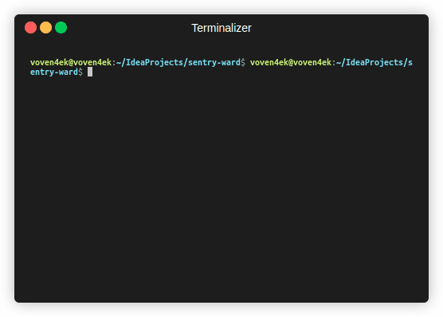

```
 _____   ___  ____   ______  ____   __ __      __    __   ____  ____   ___   
/ ___/  /  _]|    \ |      T|    \ |  T  T    |  T__T  T /    T|    \ |   \  
(   \_ /  [_ |  _  Y|      ||  D  )|  |  |    |  |  |  |Y  o  ||  D  )|    \
\__  TY    _]|  |  |l_j  l_j|    / |  ~  |    |  |  |  ||     ||    / |  D  Y
/  \ ||   [_ |  |  |  |  |  |    \ l___, |    l  `  '  !|  _  ||    \ |     |
\    ||     T|  |  |  |  |  |  .  Y|     !     \      / |  |  ||  .  Y|     |
\___jl_____jl__j__j   l__j  l__j\_jl____/       \_/\_/  l__j__jl__j\_jl_____j
```

# Sentry Ward advanced proxy scanner


***

### Advanced proxy scanner written in pure Dart.

### Supports local proxy lists and remote at the same time.

## Two output formats:

* CSV
* JSON

***

# Installation

### Using wget:

````shell
wget https://github.com/batsura-vs/sentry-ward/releases/download/sentry-ward/sentry-ward
````

# Usage
```shell
./sentry-ward -r https://example.com/proxy -l ./proxy-list.txt -f json
```

# Help:
````
 _____   ___  ____   ______  ____   __ __      __    __   ____  ____   ___   
/ ___/  /  _]|    \ |      T|    \ |  T  T    |  T__T  T /    T|    \ |   \  
(   \_ /  [_ |  _  Y|      ||  D  )|  |  |    |  |  |  |Y  o  ||  D  )|    \
\__  TY    _]|  |  |l_j  l_j|    / |  ~  |    |  |  |  ||     ||    / |  D  Y
/  \ ||   [_ |  |  |  |  |  |    \ l___, |    l  `  '  !|  _  ||    \ |     |
\    ||     T|  |  |  |  |  |  .  Y|     !     \      / |  |  ||  .  Y|     |
\___jl_____jl__j__j   l__j  l__j\_jl____/       \_/\_/  l__j__jl__j\_jl_____j


-r, --remote                Urls to remote proxy list [url1,url2,...]

-l, --local                 Paths to proxy list [path1,path2,...]
--socketTimeout             Socket timeout [ms]
                            (defaults to "2000")
                            
--connectTimeout            Connect timeout [ms]
                            (defaults to "5000")
                            
-o, --outputFile            Output file name
                            (defaults to "output.csv")
                            
-f, --outputFormat          Output format: [json, csv]
                            (defaults to "csv")
                            
-h, --help                  Provide usage instruction

-c, --concurrentRequests    Concurrent requests [number]
                            (defaults to "100")
                            
-e, --showErrors            Show errors
````
# Output example

## CSV:
| HOST            | PORT | IP_VERSION | IP_ADDRESS                    | LATITUDE   | LONGITUDE   | COUNTRY_NAME             | COUNTRY_CODE | TIME_ZONE | ZIP_CODE  | CITY_NAME         | REGION_NAME      | CONTINENT | CONTINENT_CODE |
|-----------------|------|------------|-------------------------------|------------|-------------|--------------------------|--------------|-----------|-----------|-------------------|------------------|-----------|----------------|
| 185.200.119.90  | 8443 | 4          | 185.200.119.90                | 52.378502  | 4.89998     | Netherlands              | NL           | +02:00    | 1101      | Amsterdam         | Noord-Holland    | Europe    | EU             |
| 138.199.48.1    | 8443 | 4          | 138.199.48.1                  | 43.65366   | -79.382927  | Canada                   | CA           | -04:00    | M3B 0A3   | Toronto           | Ontario          | Americas  | AM             |
| 198.58.106.30   | 8085 | 4          | 45.79.23.193                  | 32.948284  | -96.729813  | United States of America | US           | -05:00    | 75080     | Richardson        | Texas            | Americas  | AM             |
| 43.157.10.238   | 8888 | 4          | 43.157.10.238                 | 50.110882  | 8.681996    | Germany                  | DE           | +02:00    | 65931     | Frankfurt am Main | Hessen           | Europe    | EU             |
| 182.253.109.21  | 8080 | 4          | 182.253.109.21                | -6.992896  | 110.420258  | Indonesia                | ID           | +07:00    | 50249     | Semarang          | Jawa Tengah      | Asia      | AS             |
| 138.199.23.163  | 8443 | 4          | 138.199.23.163                | 35.689499  | 139.692322  | Japan                    | JP           | +09:00    | 214-0021  | Tokyo             | Tokyo            | Asia      | AS             |
| 89.187.162.69   | 8443 | 4          | 89.187.162.69                 | 1.289987   | 103.850281  | Singapore                | SG           | +08:00    | 179431    | Singapore         | Singapore        | Asia      | AS             |
| 144.48.38.39    | 8443 | 4          | 144.48.38.39                  | -37.814007 | 144.963165  | Australia                | AU           | +10:00    | 3000      | Melbourne         | Victoria         | Oceania   | OC             |
| 138.199.48.4    | 8443 | 4          | 138.199.48.1                  | 43.65366   | -79.382927  | Canada                   | CA           | -04:00    | M3B 0A3   | Toronto           | Ontario          | Americas  | AM             |
| 37.19.220.129   | 8443 | 4          | 37.19.220.129                 | 39.039474  | -77.491806  | United States of America | US           | -04:00    | 20146     | Ashburn           | Virginia         | Americas  | AM             |
| 193.87.80.129   | 3128 | 4          | 193.87.80.129                 | 47.763561  | 18.122629   | Slovakia                 | SK           | +02:00    | 945 01    | Komarno           | Nitriansky kraj  | Europe    | EU             |
| 23.152.40.14    | 3128 | 6          | 2602:fa82::20f:53ff:fe16:29c9 | 25.890091  | -80.186707  | United States of America | US           | -04:00    | 33261     | North Miami       | Florida          | Americas  | AM             |
| 5.188.34.149    | 8443 | 4          | 5.188.34.149                  | 1.289987   | 103.850281  | Singapore                | SG           | +08:00    | 535225    | Singapore         | Singapore        | Asia      | AS             |
| 129.154.228.193 | 3128 | 4          | 129.154.228.193               | 19.075975  | 72.87738    | India                    | IN           | +05:30    | 400099    | Mumbai            | Maharashtra      | Asia      | AS             |
| 129.154.251.68  | 3128 | 4          | 129.154.251.68                | 19.075975  | 72.87738    | India                    | IN           | +05:30    | 400099    | Mumbai            | Maharashtra      | Asia      | AS             |
| 201.95.254.137  | 3128 | 4          | 201.95.254.137                | -23.547121 | -46.637184  | Brazil                   | BR           | -03:00    | 01000-000 | Sao Paulo         | Sao Paulo        | Americas  | AM             |
| 37.19.220.179   | 8443 | 4          | 37.19.220.179                 | 39.039474  | -77.491806  | United States of America | US           | -04:00    | 20146     | Ashburn           | Virginia         | Americas  | AM             |
| 144.24.181.61   | 3128 | 4          | 144.24.181.61                 | 50.110882  | 8.681996    | Germany                  | DE           | +02:00    | 65931     | Frankfurt am Main | Hessen           | Europe    | EU             |
| 213.97.161.224  | 3128 | 4          | 193.146.229.222               | 41.655949  | -0.877521   | Spain                    | ES           | +02:00    | 50018     | Zaragoza          | Aragon           | Europe    | EU             |
| 82.102.26.38    | 8443 | 4          | 82.102.26.38                  | 41.894253  | 12.484253   | Italy                    | IT           | +02:00    | 00135     | Rome              | Lazio            | Europe    | EU             |
| 84.46.253.216   | 3128 | 4          | 84.46.253.216                 | 52.524525  | 13.410037   | Germany                  | DE           | +02:00    | 10178     | Berlin            | Berlin           | Europe    | EU             |
| 64.189.106.6    | 3129 | 4          | 64.189.106.6                  | 33.138382  | -96.110817  | United States of America | US           | -05:00    | 75401     | Greenville        | Texas            | Americas  | AM             |
| 147.78.1.78     | 3128 | 4          | 147.78.1.78                   | 19.428471  | -99.127609  | Mexico                   | MX           | -06:00    | 14629     | Mexico City       | Ciudad de Mexico | Americas  | AM             |
| 45.188.164.3    | 1994 | 4          | 45.188.164.3                  | 20.799999  | -104.01667  | Mexico                   | MX           | -06:00    | 48500     | Antonio Escobedo  | Jalisco          | Americas  | AM             |
| 188.166.231.208 | 8888 | 4          | 188.166.231.208               | 1.289987   | 103.850281  | Singapore                | SG           | +08:00    | 179431    | Singapore         | Singapore        | Asia      | AS             |
| 42.96.3.162     | 3128 | 4          | 42.96.3.162                   | 16.067783  | 108.220978  | Viet Nam                 | VN           | +07:00    | 550000    | Da Nang           | Da Nang          | Asia      | AS             |
| 172.105.71.205  | 3128 | 4          | 172.105.71.205                | 50.110882  | 8.681996    | Germany                  | DE           | +02:00    | 65931     | Frankfurt am Main | Hessen           | Europe    | EU             |
| 146.190.104.55  | 8888 | 4          | 146.190.104.55                | 1.289987   | 103.850281  | Singapore                | SG           | +08:00    | 179431    | Singapore         | Singapore        | Asia      | AS             |
| 203.142.78.172  | 8080 | 4          | 203.142.78.172                | -6.8643    | 111.120201  | Indonesia                | ID           | +07:00    | 59183     | Guyangan          | Jawa Tengah      | Asia      | AS             |
| 189.203.139.247 | 8080 | 4          | 189.203.139.247               | 20.600096  | -100.383926 | Mexico                   | MX           | -06:00    | 38596     | Queretaro         | Queretaro        | Americas  | AM             |
| 168.205.79.121  | 8081 | 4          | 168.205.79.121                | -12.54528  | -55.711391  | Brazil                   | BR           | -04:00    | 78557-452 | Sorriso           | Mato Grosso      | Americas  | AM             |
| 38.56.250.58    | 999  | 4          | 38.56.250.58                  | 19.313848  | -98.241791  | Mexico                   | MX           | -06:00    | 90115     | Tlaxcala          | Tlaxcala         | Americas  | AM             |

## JSON:
```json
[
  {
    "host": "185.200.119.90",
    "port": 8443,
    "ipInfo": {
      "ipVersion": 4,
      "ipAddress": "185.200.119.90",
      "latitude": 52.378502,
      "longitude": 4.89998,
      "countryName": "Netherlands",
      "countryCode": "NL",
      "timeZone": "+02:00",
      "zipCode": "1101",
      "cityName": "Amsterdam",
      "regionName": "Noord-Holland",
      "continent": "Europe",
      "continentCode": "EU"
    }
  },
  {
    "host": "138.199.48.1",
    "port": 8443,
    "ipInfo": {
      "ipVersion": 4,
      "ipAddress": "138.199.48.1",
      "latitude": 43.65366,
      "longitude": -79.382927,
      "countryName": "Canada",
      "countryCode": "CA",
      "timeZone": "-04:00",
      "zipCode": "M3B 0A3",
      "cityName": "Toronto",
      "regionName": "Ontario",
      "continent": "Americas",
      "continentCode": "AM"
    }
  },
  {
    "host": "198.58.106.30",
    "port": 8085,
    "ipInfo": {
      "ipVersion": 4,
      "ipAddress": "45.79.23.193",
      "latitude": 32.948284,
      "longitude": -96.729813,
      "countryName": "United States of America",
      "countryCode": "US",
      "timeZone": "-05:00",
      "zipCode": "75080",
      "cityName": "Richardson",
      "regionName": "Texas",
      "continent": "Americas",
      "continentCode": "AM"
    }
  },
  {
    "host": "8.219.97.248",
    "port": 80,
    "ipInfo": {
      "ipVersion": 4,
      "ipAddress": "8.219.64.236",
      "latitude": 1.289987,
      "longitude": 103.850281,
      "countryName": "Singapore",
      "countryCode": "SG",
      "timeZone": "+08:00",
      "zipCode": "179431",
      "cityName": "Singapore",
      "regionName": "Singapore",
      "continent": "Asia",
      "continentCode": "AS"
    }
  },
  {
    "host": "182.253.109.21",
    "port": 8080,
    "ipInfo": {
      "ipVersion": 4,
      "ipAddress": "182.253.109.21",
      "latitude": -6.992896,
      "longitude": 110.420258,
      "countryName": "Indonesia",
      "countryCode": "ID",
      "timeZone": "+07:00",
      "zipCode": "50249",
      "cityName": "Semarang",
      "regionName": "Jawa Tengah",
      "continent": "Asia",
      "continentCode": "AS"
    }
  },
  {
    "host": "138.199.23.163",
    "port": 8443,
    "ipInfo": {
      "ipVersion": 4,
      "ipAddress": "138.199.23.163",
      "latitude": 35.689499,
      "longitude": 139.692322,
      "countryName": "Japan",
      "countryCode": "JP",
      "timeZone": "+09:00",
      "zipCode": "214-0021",
      "cityName": "Tokyo",
      "regionName": "Tokyo",
      "continent": "Asia",
      "continentCode": "AS"
    }
  },
  {
    "host": "89.187.162.69",
    "port": 8443,
    "ipInfo": {
      "ipVersion": 4,
      "ipAddress": "89.187.162.69",
      "latitude": 1.289987,
      "longitude": 103.850281,
      "countryName": "Singapore",
      "countryCode": "SG",
      "timeZone": "+08:00",
      "zipCode": "179431",
      "cityName": "Singapore",
      "regionName": "Singapore",
      "continent": "Asia",
      "continentCode": "AS"
    }
  },
  {
    "host": "144.48.38.39",
    "port": 8443,
    "ipInfo": {
      "ipVersion": 4,
      "ipAddress": "144.48.38.39",
      "latitude": -37.814007,
      "longitude": 144.963165,
      "countryName": "Australia",
      "countryCode": "AU",
      "timeZone": "+10:00",
      "zipCode": "3000",
      "cityName": "Melbourne",
      "regionName": "Victoria",
      "continent": "Oceania",
      "continentCode": "OC"
    }
  },
  {
    "host": "138.199.48.4",
    "port": 8443,
    "ipInfo": {
      "ipVersion": 4,
      "ipAddress": "138.199.48.1",
      "latitude": 43.65366,
      "longitude": -79.382927,
      "countryName": "Canada",
      "countryCode": "CA",
      "timeZone": "-04:00",
      "zipCode": "M3B 0A3",
      "cityName": "Toronto",
      "regionName": "Ontario",
      "continent": "Americas",
      "continentCode": "AM"
    }
  },
  {
    "host": "37.19.220.129",
    "port": 8443,
    "ipInfo": {
      "ipVersion": 4,
      "ipAddress": "37.19.220.129",
      "latitude": 39.039474,
      "longitude": -77.491806,
      "countryName": "United States of America",
      "countryCode": "US",
      "timeZone": "-04:00",
      "zipCode": "20146",
      "cityName": "Ashburn",
      "regionName": "Virginia",
      "continent": "Americas",
      "continentCode": "AM"
    }
  },
  {
    "host": "23.152.40.14",
    "port": 3128,
    "ipInfo": {
      "ipVersion": 6,
      "ipAddress": "2602:fa82::20f:53ff:fe16:29c9",
      "latitude": 25.890091,
      "longitude": -80.186707,
      "countryName": "United States of America",
      "countryCode": "US",
      "timeZone": "-04:00",
      "zipCode": "33261",
      "cityName": "North Miami",
      "regionName": "Florida",
      "continent": "Americas",
      "continentCode": "AM"
    }
  },
  {
    "host": "37.19.220.179",
    "port": 8443,
    "ipInfo": {
      "ipVersion": 4,
      "ipAddress": "37.19.220.179",
      "latitude": 39.039474,
      "longitude": -77.491806,
      "countryName": "United States of America",
      "countryCode": "US",
      "timeZone": "-04:00",
      "zipCode": "20146",
      "cityName": "Ashburn",
      "regionName": "Virginia",
      "continent": "Americas",
      "continentCode": "AM"
    }
  },
  {
    "host": "201.95.254.137",
    "port": 3128,
    "ipInfo": {
      "ipVersion": 4,
      "ipAddress": "201.95.254.137",
      "latitude": -23.547121,
      "longitude": -46.637184,
      "countryName": "Brazil",
      "countryCode": "BR",
      "timeZone": "-03:00",
      "zipCode": "01000-000",
      "cityName": "Sao Paulo",
      "regionName": "Sao Paulo",
      "continent": "Americas",
      "continentCode": "AM"
    }
  },
  {
    "host": "122.155.165.191",
    "port": 3128,
    "ipInfo": {
      "ipVersion": 4,
      "ipAddress": "122.155.165.191",
      "latitude": 14.065074,
      "longitude": 100.645935,
      "countryName": "Thailand",
      "countryCode": "TH",
      "timeZone": "+07:00",
      "zipCode": "12120",
      "cityName": "Khlong Luang",
      "regionName": "Pathum Thani",
      "continent": "Asia",
      "continentCode": "AS"
    }
  },
  {
    "host": "82.102.26.38",
    "port": 8443,
    "ipInfo": {
      "ipVersion": 4,
      "ipAddress": "82.102.26.38",
      "latitude": 41.894253,
      "longitude": 12.484253,
      "countryName": "Italy",
      "countryCode": "IT",
      "timeZone": "+02:00",
      "zipCode": "00135",
      "cityName": "Rome",
      "regionName": "Lazio",
      "continent": "Europe",
      "continentCode": "EU"
    }
  },
  {
    "host": "5.188.34.149",
    "port": 8443,
    "ipInfo": {
      "ipVersion": 4,
      "ipAddress": "5.188.34.149",
      "latitude": 1.289987,
      "longitude": 103.850281,
      "countryName": "Singapore",
      "countryCode": "SG",
      "timeZone": "+08:00",
      "zipCode": "535225",
      "cityName": "Singapore",
      "regionName": "Singapore",
      "continent": "Asia",
      "continentCode": "AS"
    }
  },
  {
    "host": "20.50.138.159",
    "port": 3128,
    "ipInfo": {
      "ipVersion": 4,
      "ipAddress": "20.50.138.159",
      "latitude": 52.378502,
      "longitude": 4.89998,
      "countryName": "Netherlands",
      "countryCode": "NL",
      "timeZone": "+02:00",
      "zipCode": "1000",
      "cityName": "Amsterdam",
      "regionName": "Noord-Holland",
      "continent": "Europe",
      "continentCode": "EU"
    }
  },
  {
    "host": "103.17.77.5",
    "port": 3128,
    "ipInfo": {
      "ipVersion": 4,
      "ipAddress": "103.17.76.57",
      "latitude": -7.979982,
      "longitude": 112.630196,
      "countryName": "Indonesia",
      "countryCode": "ID",
      "timeZone": "+07:00",
      "zipCode": "65136",
      "cityName": "Malang",
      "regionName": "Jawa Timur",
      "continent": "Asia",
      "continentCode": "AS"
    }
  },
  {
    "host": "84.46.253.216",
    "port": 3128,
    "ipInfo": {
      "ipVersion": 4,
      "ipAddress": "84.46.253.216",
      "latitude": 52.524525,
      "longitude": 13.410037,
      "countryName": "Germany",
      "countryCode": "DE",
      "timeZone": "+02:00",
      "zipCode": "10178",
      "cityName": "Berlin",
      "regionName": "Berlin",
      "continent": "Europe",
      "continentCode": "EU"
    }
  },
  {
    "host": "129.154.228.193",
    "port": 3128,
    "ipInfo": {
      "ipVersion": 4,
      "ipAddress": "129.154.228.193",
      "latitude": 19.075975,
      "longitude": 72.87738,
      "countryName": "India",
      "countryCode": "IN",
      "timeZone": "+05:30",
      "zipCode": "400099",
      "cityName": "Mumbai",
      "regionName": "Maharashtra",
      "continent": "Asia",
      "continentCode": "AS"
    }
  },
  {
    "host": "188.166.231.208",
    "port": 8888,
    "ipInfo": {
      "ipVersion": 4,
      "ipAddress": "188.166.231.208",
      "latitude": 1.289987,
      "longitude": 103.850281,
      "countryName": "Singapore",
      "countryCode": "SG",
      "timeZone": "+08:00",
      "zipCode": "179431",
      "cityName": "Singapore",
      "regionName": "Singapore",
      "continent": "Asia",
      "continentCode": "AS"
    }
  },
  {
    "host": "146.190.104.55",
    "port": 8888,
    "ipInfo": {
      "ipVersion": 4,
      "ipAddress": "146.190.104.55",
      "latitude": 1.289987,
      "longitude": 103.850281,
      "countryName": "Singapore",
      "countryCode": "SG",
      "timeZone": "+08:00",
      "zipCode": "179431",
      "cityName": "Singapore",
      "regionName": "Singapore",
      "continent": "Asia",
      "continentCode": "AS"
    }
  },
  {
    "host": "201.182.251.140",
    "port": 999,
    "ipInfo": {
      "ipVersion": 4,
      "ipAddress": "201.182.251.140",
      "latitude": 1.213564,
      "longitude": -77.281357,
      "countryName": "Colombia",
      "countryCode": "CO",
      "timeZone": "-05:00",
      "zipCode": "-",
      "cityName": "Pasto",
      "regionName": "Narino",
      "continent": "Americas",
      "continentCode": "AM"
    }
  },
  {
    "host": "203.142.78.172",
    "port": 8080,
    "ipInfo": {
      "ipVersion": 4,
      "ipAddress": "203.142.78.172",
      "latitude": -6.8643,
      "longitude": 111.120201,
      "countryName": "Indonesia",
      "countryCode": "ID",
      "timeZone": "+07:00",
      "zipCode": "59183",
      "cityName": "Guyangan",
      "regionName": "Jawa Tengah",
      "continent": "Asia",
      "continentCode": "AS"
    }
  },
  {
    "host": "168.205.79.121",
    "port": 8081,
    "ipInfo": {
      "ipVersion": 4,
      "ipAddress": "168.205.79.121",
      "latitude": -12.54528,
      "longitude": -55.711391,
      "countryName": "Brazil",
      "countryCode": "BR",
      "timeZone": "-04:00",
      "zipCode": "78557-452",
      "cityName": "Sorriso",
      "regionName": "Mato Grosso",
      "continent": "Americas",
      "continentCode": "AM"
    }
  },
  {
    "host": "64.189.106.6",
    "port": 3129,
    "ipInfo": {
      "ipVersion": 4,
      "ipAddress": "64.189.106.6",
      "latitude": 33.138382,
      "longitude": -96.110817,
      "countryName": "United States of America",
      "countryCode": "US",
      "timeZone": "-05:00",
      "zipCode": "75401",
      "cityName": "Greenville",
      "regionName": "Texas",
      "continent": "Americas",
      "continentCode": "AM"
    }
  },
  {
    "host": "119.155.5.44",
    "port": 8080,
    "ipInfo": {
      "ipVersion": 4,
      "ipAddress": "119.155.5.44",
      "latitude": 31.716669,
      "longitude": 73.383331,
      "countryName": "Pakistan",
      "countryCode": "PK",
      "timeZone": "+05:00",
      "zipCode": "39600",
      "cityName": "Sangla Hill",
      "regionName": "Punjab",
      "continent": "Asia",
      "continentCode": "AS"
    }
  },
  {
    "host": "42.96.3.162",
    "port": 3128,
    "ipInfo": {
      "ipVersion": 4,
      "ipAddress": "42.96.3.162",
      "latitude": 16.067783,
      "longitude": 108.220978,
      "countryName": "Viet Nam",
      "countryCode": "VN",
      "timeZone": "+07:00",
      "zipCode": "550000",
      "cityName": "Da Nang",
      "regionName": "Da Nang",
      "continent": "Asia",
      "continentCode": "AS"
    }
  }
]
```